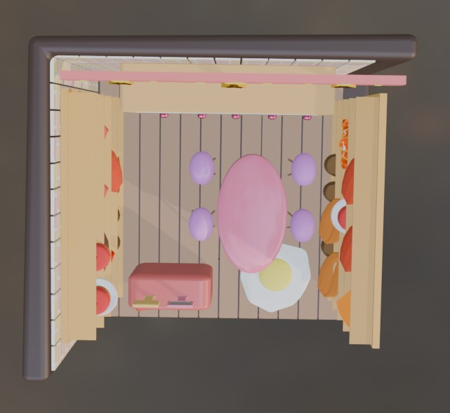
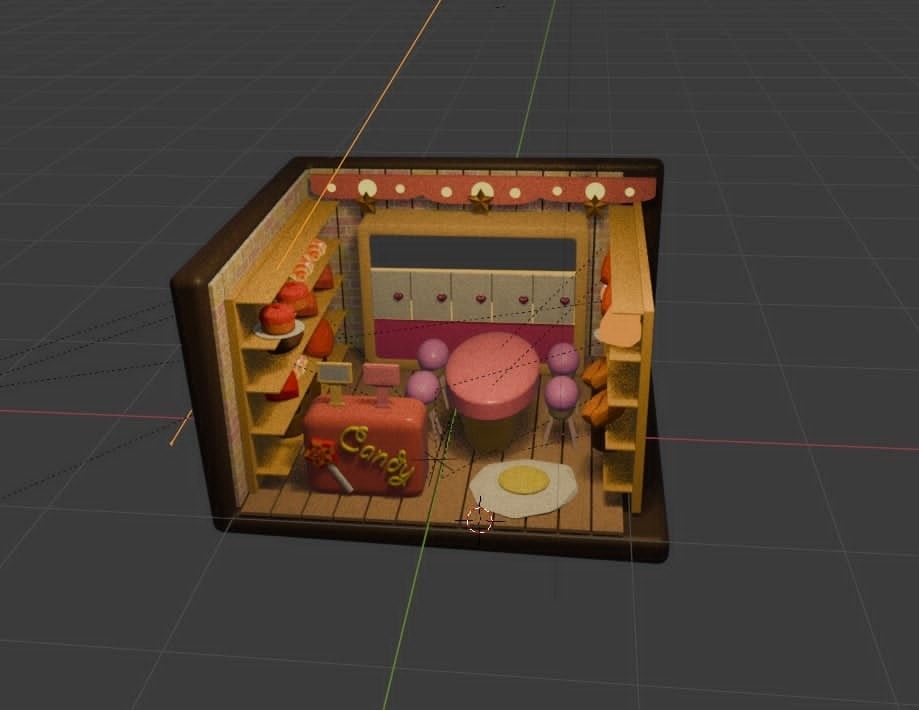

<!-- ========= COVER ========= -->

  

<!-- ========= ANIMATED SECTION TITLE (đã mix màu trong SVG) ========= -->

  

<!-- ========= TYPING INTRO (màu Deep Navy) ========= -->

  

<!-- ========= NAME ========= -->
<h1 align="center">Nguyễn Đỗ Tú Mai</h1>

  Sinh viên <b>Công nghệ Đa phương tiện</b> — Học Viện Công Nghệ Bưu Chính Viễn Thông (PTIT) – CS TP.HCM 
  Định hướng: <b>Branding Marketing Designer</b> → <i>Art Director / Brand Design Lead</i>

<!-- ========= BADGES (stars / views) ========= -->

  
  

<!-- ========= DIVIDER ========= -->
<picture>
  <source media="(prefers-color-scheme: dark)" srcset="https://raw.githubusercontent.com/andreasbm/readme/master/assets/lines/colored.png">
  
</picture>

## 🧭 Mục lục
- [Contact me](#-contact-me)
- [Giới thiệu nhanh](#-giới-thiệu-nhanh)
- [Trình độ học vấn](#-trình-độ-học-vấn)
- [Kỹ năng](#️-kỹ-năng)
- [Dự án cá nhân](#-dự-án-cá-nhân)
- [Tài liệu Ngữ văn/Tiếng Anh](#-tài-liệu-ngữ-văntiếng-anh)
- [GitHub Stats](#-github-stats)
- [Quote of the day](#-quote-of-the-day)

---

## 💌 Contact me
<ul>
  <li>
    
    <a href="mailto:tmaing218@gmail.com">tmaing218@gmail.com</a>
  </li>
  <li>
    
    <a href="https://www.facebook.com/tmaingyn/" target="_blank">Tu Mai Nguyen</a>
  </li>
  <li>
    
    <a href="https://instagram.com/maydate_" target="_blank">@maydate_</a>
  </li>
  <li>📞 <a href="tel:+84857346510">0857 346 510</a></li>
</ul>

<!-- Skill badges — mix màu palette -->

  
  
  
  
  

---

## 👋 Giới thiệu nhanh
- Yêu thích Branding/Marketing Design & thiết kế có chiến lược.
- Tư duy trực quan, giao tiếp tốt; đã có kinh nghiệm gia sư và soạn giáo án.
- Mục tiêu: **Branding Marketing Designer** → **Art Director / Brand Design Lead**.

---

## 🎓 Trình độ học vấn
- HSG Ngữ Văn cấp Thành phố (2023); 3 năm liền trong đội tuyển HSG Ngữ Văn THPT Phan Đăng Lưu (Q. Bình Thạnh).
- Ngữ Văn 9.0, Tiếng Anh 9.6 (Kì thi tốt nghiệp THPTQG 2023).
- TOEIC: 795/990 · IELTS: 6.5
- GPA: 2 học kỳ đạt > 3.27/4.0 (Loại Giỏi)

---

## 🧰️ Kỹ năng
<table>
  <thead>
    <tr>
      <th align="left">Kỹ năng</th>
      <th align="left">Đánh giá (⭐)</th>
      <th align="left">Tự chấm</th>
    </tr>
  </thead>
  <tbody>
    <tr><td>Tiếng Anh</td><td>⭐⭐⭐⭐☆</td><td><progress value="80" max="100"></progress> 80%</td></tr>
    <tr><td>Dạy kèm Văn/Anh THPT</td><td>⭐⭐⭐☆☆</td><td><progress value="60" max="100"></progress> 60%</td></tr>
    <tr><td>Dạy kèm Tiểu học–Cấp 2–Cấp 3 (5 năm)</td><td>⭐⭐⭐⭐☆</td><td><progress value="80" max="100"></progress> 80%</td></tr>
    <tr><td>Tin học văn phòng</td><td>⭐⭐⭐☆☆</td><td><progress value="60" max="100"></progress> 60%</td></tr>
    <tr><td>Soạn giáo án dạy học</td><td>⭐⭐⭐☆☆</td><td><progress value="60" max="100"></progress> 60%</td></tr>
    <tr><td>Truyền đạt–Thuyết trình</td><td>⭐⭐⭐⭐☆</td><td><progress value="80" max="100"></progress> 80%</td></tr>
    <tr><td>Tư duy phản biện</td><td>⭐⭐⭐☆☆</td><td><progress value="60" max="100"></progress> 60%</td></tr>
    <tr><td>Linh hoạt, sáng tạo</td><td>⭐⭐⭐☆☆</td><td><progress value="60" max="100"></progress> 60%</td></tr>
  </tbody>
</table>

**Công cụ đồ họa:** Adobe Illustrator, Adobe Photoshop, Blender, CapCut  
**Kiến thức nền tảng:** Branding & Marketing

---

## 🗂 Dự án cá nhân

  
  
  

<!-- START: LABS INDEX -->
## 🧪 Danh sách LAB đã hoàn thành

> Bấm vào tên để mở repo/thư mục. Với Lab 05 có link PDF trực tiếp.

### 🔹 Repo nhóm 
**se-atm-2025-group-mai-thuy-han**  
https://github.com/TuMaiNguyen/se-atm-2025-group-mai-thuy-han

  
<b>📂 Xem 8 lab trong thư mục <code>labs/</code></b>

- LAB01 — Thiết lập môi trường & Quản lý dự án  
  https://github.com/TuMaiNguyen/se-atm-2025-group-mai-thuy-han/tree/main/labs/lab01

- LAB02 — Phân tích yêu cầu (Use Case – nhóm)  
  https://github.com/TuMaiNguyen/se-atm-2025-group-mai-thuy-han/tree/main/labs/lab02

- LAB03 — UML (nhóm)  
  https://github.com/TuMaiNguyen/se-atm-2025-group-mai-thuy-han/tree/main/labs/lab03

- LAB04 — Coding form Login (HTML/CSS/JS)  
  https://github.com/TuMaiNguyen/se-atm-2025-group-mai-thuy-han/tree/main/labs/lab04-login

- LAB05 — Report tổng hợp (nhóm)  
  https://github.com/TuMaiNguyen/se-atm-2025-group-mai-thuy-han/tree/main/labs/lab05-report

- LAB06 — ATM: Class & Package Diagram  
  https://github.com/TuMaiNguyen/se-atm-2025-group-mai-thuy-han/tree/main/labs/lab06-atm-class

- LAB07 — Module Rút tiền (Prototype)  
  https://github.com/TuMaiNguyen/se-atm-2025-group-mai-thuy-han/tree/main/labs/lab07-withdraw-module

- LAB08 — Kiểm thử ATM (Unit & Integration)  
  https://github.com/TuMaiNguyen/se-atm-2025-group-mai-thuy-han/tree/main/labs/lab08-testing

---

### 🔹 Repo cá nhân theo từng lab
| # | Lab | Link chính | Ghi chú |
|---|-----|------------|--------|
| 02 | Hotel Booking (Use Case – cá nhân) | https://github.com/TuMaiNguyen/lab02-hotel-booking-mai | Có UC + mô tả |
| 03 | Testing Login (Selenium + pytest) | https://github.com/TuMaiNguyen/n23dcpt091-lab03-login | Có test & báo cáo |
| 05 | Lecture 05 – Testing (tài liệu + bài làm) | https://github.com/TuMaiNguyen/Lecture05-Testing-N23DCPT091 | PDF ở cột dưới |

**📑 PDF trực tiếp (Lab 05):**  
- Bài giảng: <https://github.com/TuMaiNguyen/Lecture05-Testing-N23DCPT091/blob/main/Lecture%2005%20Testing.pdf>  
- Bài làm (Nguyễn Đỗ Tú Mai): <https://github.com/TuMaiNguyen/Lecture05-Testing-N23DCPT091/blob/main/NGUYỄN%20ĐỖ%20TÚ%20MAI-N23DCPT091-LECTURE05-TESTING.pdf>
<!-- END: LABS INDEX -->

---

## 📘 Tài liệu Ngữ văn/Tiếng Anh đã từng soạn 

  
<b>📚 Danh sách tập tin (bấm để mở)</b>

  <ul>
    <li>🟦 <a href="<./Đề 03.docx>">Đề 03.docx</a></li>
    <li>🟦 <a href="<./ĐỀ ÔN 12-4, Chế lan viên.docx>">ĐỀ ÔN 12-4, Chế lan viên.docx</a></li>
    <li>🟦 <a href="<./Đề ôn tập 7-1 đáp án.docx>">Đề ôn tập 7-1 đáp án.docx</a></li>
    <li>🟦 <a href="<./-Trích-dẫn-Mở-đoạn-Kết-đoạn-NLXH.docx>">-Trích-dẫn-Mở-đoạn-Kết-đoạn-NLXH.docx</a></li>
    <li>🟥 <a href="<./DẠNG BÀI SẮP XẾP CÂU TẠO THÀNH ĐOẠN HỘI THOẠI-ĐOẠN VĂN- LÁ THƯ (1).pdf>">Dạng bài sắp xếp câu – Lá thư (PDF)</a></li>
  </ul>

---

## 📊 GitHub Stats 

  
  

<!-- Snake (workflow đã tạo) -->

  

---

## 🧠 Quote of the day

  

💙 Cảm ơn bạn đã xem hồ sơ! Nếu thấy hữu ích, hãy ⭐ repo này nhé.

