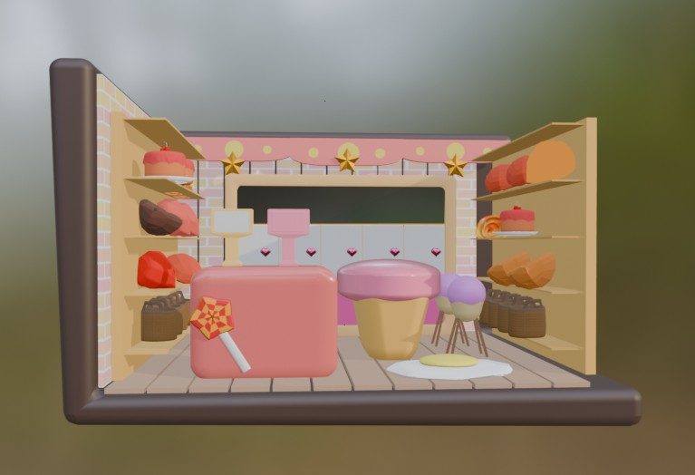

<!-- ====== COVER ====== -->

  

<h1 align="center">Nguyễn Đỗ Tú Mai</h1>

  Sinh viên <b>Công nghệ Đa phương tiện</b> — Há»c Viện Công Nghệ Bưu Chính Viễn Thông (PTIT) – CS TP.HCM 
  Định hướng: <b>Branding Marketing Designer</b> → <i>Art Director / Brand Design Lead</i>

---

## 🧭 Mục lục
- [Giới thiệu nhanh](#-giới-thiệu-nhanh)
- [Contact me](#-contact-me)
- [Trình độ học vấn](#-trình-độ-học-vấn)
- [Kỹ năng](#️-kỹ-năng)
- [Dự án cá nhân](#-dự-án-cá-nhân)
- [Tài liệu Ngữ văn/Tiếng Anh đã từng soạn](#-tài-liệu-ngữ-văntiếng-anh-đã-từng-soạn)
- [Sở thích](#️-sở-thích)
- [Kinh nghiệm](#-kinh-nghiệm)
- [Mục tiêu nghề nghiệp](#-mục-tiêu-nghề-nghiệp)

---

## 👋 Giới thiệu nhanh
- Yêu thích Branding/Marketing Design & thiết kế có chiến lược.
- Tư duy trực quan, giao tiếp tốt; đã có kinh nghiệm gia sư và soạn giáo án.
- Mục tiêu: trở thành **Branding Marketing Designer** và xa hơn là **Art Director / Brand Design Lead**.

---

## 💌 Contact me
<ul>
  <li>
    
    <a href="mailto:tmaing218@gmail.com">tmaing218@gmail.com</a>
  </li>
  <li>
    
    <a href="https://www.facebook.com/tmaingyn/" target="_blank">Tu Mai Nguyen</a>
  </li>
  <li>
    
    <a href="https://instagram.com/maydate_" target="_blank">@maydate_</a>
  </li>
  <li>📞 <a href="tel:+84857346510">0857 346 510</a></li>
</ul>

---

## 🎓 Trình độ học vấn
- HSG Ngữ Văn cấp Thành phố (2023); 3 năm liền trong đội tuyển HSG Ngữ Văn THPT Phan Đăng Lưu (Q. Bình Thạnh).
- Thủ khoa khối của trường: Ngữ Văn 9.0, Tiếng Anh 9.6 (THPTQG 2023).
- TOEIC: 795/990 · IELTS: 6.5
- GPA: 2 học kỳ đạt > 3.27/4.0 (Loại Giỏi)

---

## 🧰️ Kỹ năng

<table>
  <thead>
    <tr>
      <th align="left">Kỹ năng</th>
      <th align="left">Đánh giá (⭐)</th>
      <th align="left">Tự chấm (progress)</th>
    </tr>
  </thead>
  <tbody>
    <tr>
      <td>Tiếng Anh</td>
      <td>⭐⭐⭐⭐☆</td>
      <td><progress value="80" max="100"></progress> 80%</td>
    </tr>
    <tr>
      <td>Dạy kèm Văn/Anh THPT</td>
      <td>⭐⭐⭐☆☆</td>
      <td><progress value="60" max="100"></progress> 60%</td>
    </tr>
    <tr>
      <td>Dạy kèm Tiểu học–Cấp 2–Cấp 3 (5 năm)</td>
      <td>⭐⭐⭐⭐☆</td>
      <td><progress value="80" max="100"></progress> 80%</td>
    </tr>
    <tr>
      <td>Tin học văn phòng</td>
      <td>⭐⭐⭐☆☆</td>
      <td><progress value="60" max="100"></progress> 60%</td>
    </tr>
    <tr>
      <td>Soạn giáo án dạy học</td>
      <td>⭐⭐⭐☆☆</td>
      <td><progress value="60" max="100"></progress> 60%</td>
    </tr>
    <tr>
      <td>Truyền đạt–Thuyết trình</td>
      <td>⭐⭐⭐⭐☆</td>
      <td><progress value="80" max="100"></progress> 80%</td>
    </tr>
    <tr>
      <td>Tư duy phản biện</td>
      <td>⭐⭐⭐☆☆</td>
      <td><progress value="60" max="100"></progress> 60%</td>
    </tr>
    <tr>
      <td>Linh hoạt, sáng tạo</td>
      <td>⭐⭐⭐☆☆</td>
      <td><progress value="60" max="100"></progress> 60%</td>
    </tr>
  </tbody>
</table>

<b>Công cụ đồ họa:</b> Adobe Illustrator, Adobe Photoshop, Blender, CapCut  
<b>Kiến thức nền tảng:</b> Branding & Marketing

---

## 🗂 Dự án cá nhân

  
    
  
  

---

## 📘 Tài liệu Ngữ văn/Tiếng Anh đã từng soạn

> Nhấn vào tên để tải/xem ngay trên GitHub.  
> 🟦 = DOCX · 🟥 = PDF

### 📝 Đề thi / Đề số
- 🟦 [đề thi thử 28-3 dápddasp án.docx](<./đề thi thử 28-3 dápddasp án.docx>)
- 🟦 [Đề 03.docx](<./Đề 03.docx>)

### 🔁 Ôn tập
- 🟦 [ĐỀ ÔN 12-4, Chế lan viên.docx](<./ĐỀ ÔN 12-4, Chế lan viên.docx>)
- 🟦 [Đề ôn tập 7-1 đáp án.docx](<./Đề ôn tập 7-1 đáp án.docx>)
- 🟦 [ĐỀ ÔN TẬP T3 - NGỮ VĂN - BÀI SOẠN.docx](<./ĐỀ ÔN TẬP T3 - NGỮ VĂN - BÀI SOẠN.docx>)

### 📌 Bài soạn / NLXH
- 🟦 [-Trích-dẫn-Mở-đoạn-Kết-đoạn-NLXH.docx](<./-Trích-dẫn-Mở-đoạn-Kết-đoạn-NLXH.docx>)

### 📄 Dạng bài
- 🟥 [DẠNG BÀI SẮP XẾP CÂU TẠO THÀNH ĐOẠN HỘI THOẠI-ĐOẠN VĂN- LÁ THƯ (1).pdf](<./DẠNG BÀI SẮP XẾP CÂU TẠO THÀNH ĐOẠN HỘI THOẠI-ĐOẠN VĂN- LÁ THƯ (1).pdf>)
- 🟥 [Nỗi sợ hãi.pdf](<./Nỗi sợ hãi.pdf>)

---

## ❤️ Sở thích
- Dạy kèm môn Văn/Anh; nghiên cứu tài liệu để bài giảng dễ hiểu.
- Xem & phân tích các dự án Design để học hỏi.
- Phân tích thơ/tác phẩm văn học Chế Lan Viên (1920–1989), Hàn Mặc Tử (1912–1940).
- Tham gia workshop chuyên ngành; đọc sách về lịch sử, chiến tranh, kháng chiến.
- Học Tiếng Anh qua việc đọc các bài báo song ngữ.

---

## 💼 Kinh nghiệm
- Làm việc nhóm từ THCS–THPT–ĐH; mạnh về quản lý công việc & kiểm duyệt nội dung.
- Lên nội dung bài giảng & soạn giáo án.
- Giảng dạy từ 2020–2025 (gia sư tại nhà).

---

## 🎯 Mục tiêu nghề nghiệp
- Trở thành **Branding Marketing Designer** giàu kinh nghiệm.
- Thiết kế, định hình & duy trì hình ảnh thương hiệu nhất quán trên mọi kênh.
- Ứng dụng thẩm mỹ + marketing để tạo sản phẩm thiết kế có chiến lược, truyền tải thông điệp và thúc đẩy nhận diện/doanh số.
- Hợp tác hiệu quả với team marketing, content, truyền thông & khách hàng để chuyển hoá chiến lược thành sản phẩm thực tế.
- <b>Dài hạn:</b> Art Director / Brand Design Lead.

---

💙 Cảm ơn bạn đã xem hồ sơ! Nếu thấy hữu ích, hãy ⭠repo này nhé.

